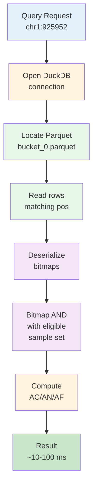

# Performance Tuning

## Build Phase

The build phase is the most resource-intensive part of `create-db` and `update-db --add-samples`. It aggregates per-sample genotype data into Roaring Bitmap Parquet files.

### Key Options

| Option | Default | Effect |
|--------|---------|--------|
| `--build-threads` | all CPUs | Number of parallel DuckDB workers |
| `--build-memory` | `2GB` | DuckDB memory limit per worker |

### Memory Sizing

Each worker processes one 1-Mbp bucket independently. Memory usage depends on cohort size and variant density:

| Cohort size | Typical peak per worker |
|-------------|------------------------|
| 1K samples | ~200 MB |
| 10K samples | ~500 MB |
| 50K samples | ~1–2 GB |

Set `--build-memory` to the expected peak plus 20% headroom. For WGS with dense variant regions, use `4GB` or higher.

### Thread Scaling

All 1-Mbp buckets across all chromosomes are discovered upfront and distributed to workers. With 52 cores and 2,500 buckets, all cores can run concurrently:

```bash
afquery create-db \
  --manifest manifest.tsv \
  --output-dir ./db/ \
  --genome-build GRCh38 \
  --build-threads 52 \
  --build-memory 4GB
```

!!! note "Worker capping"
    Workers are capped to `min(--build-threads, n_buckets)` — if you have more threads than buckets, the excess workers are simply idle. Use `afquery info --db ./db/` to check the number of buckets after build.

Expected scaling (50K samples, 2,500 buckets, GRCh38):

| Cores | Build time | Speedup vs. 1 core |
|-------|-----------|-------------------|
| 1 | ~8 hours | 1× |
| 4 | ~2 hours | ~4× |
| 8 | ~1 hour | ~7× |
| 16 | ~30 min | ~14× |
| 32 | ~18 min | ~24× |
| 52 | ~13 min | ~38× |

Scaling is near-linear up to ~32 cores; beyond that, disk I/O contention limits further gains.

Total RAM required: `build_threads × build_memory`

```bash
# 16 threads × 2GB = 32 GB peak
afquery create-db ... --build-threads 16 --build-memory 2GB

# 8 threads × 4GB = 32 GB peak (better for dense WGS)
afquery create-db ... --build-threads 8 --build-memory 4GB
```

### Ingest Phase

The `--threads` option (distinct from `--build-threads`) controls VCF parsing parallelism. It uses `ProcessPoolExecutor` with one process per sample. Set to the number of I/O-bound cores available:

```bash
afquery create-db ... --threads 32 --build-threads 16 --build-memory 4GB
```

---

## Query Phase

### Query Execution Path



### Sub-100 ms Point Queries

Query performance for a typical 50K-sample cohort (see [Benchmarking](benchmarking.md) to measure these on your own database):

| Query type | Cold (first call) | Warm (cached) |
|------------|-------------------|---------------|
| Point query | < 100 ms | ~10 ms |
| Region (1 Mbp) | ~300 ms | ~50 ms |
| Batch (100 variants) | ~200 ms | ~20 ms |

### DuckDB Connection

AFQuery opens a **fresh DuckDB connection per query call** and closes it before return. This is intentional for thread safety — connections are not reused. If you are calling `db.query()` in a tight loop, the per-connection overhead (~5 ms) may become significant.

For high-throughput batch workloads, use `db.query_batch()` or `db.query_region()` to amortize connection overhead over many variants.

### Cold vs Warm Queries

The first query on a chromosome reads Parquet data from disk into OS cache. Subsequent queries on the same chromosome benefit from the OS page cache. On systems with sufficient RAM, warm query times are order-of-magnitude faster.

To "warm up" a chromosome:
```python
# One region query to load the chromosome into OS cache
db.query_region("chr1", start=1, end=250_000_000)
```

---

## Annotation

### Thread Scaling

`afquery annotate` parallelizes variant annotation across `--threads` workers. Scaling is near-linear up to the number of available cores:

```bash
# 4-core machine
afquery annotate --db ./db/ --input variants.vcf --output annotated.vcf --threads 4

# 32-core machine
afquery annotate --db ./db/ --input variants.vcf --output annotated.vcf --threads 32
```

Disk I/O is the bottleneck for very large VCFs on spinning disks. SSDs or NVMe storage are recommended for annotation workloads.

---

## Disk Usage Estimates

Parquet with Roaring Bitmap encoding is very compact:

| Scenario | Estimate |
|----------|----------|
| Storage per variant per sample | ~2 bytes |
| 50K samples, 100M variants | ~10 TB |
| 1K samples, 10M variants | ~20 GB |

Actual disk usage depends on variant density and carrier rates. Rare variants (low AC) compress better than common variants.

---

## Memory at Query Time

Query memory is very low:

- **Bitmap operations**: only the relevant bitmaps are loaded from Parquet (~64 KB per variant at 50K samples)
- **No full chromosome load**: DuckDB reads only the specific rows matching the query position
- **Capture index**: one small interval tree per WES technology loaded at `Database.__init__`

Typical query-time RAM: < 500 MB regardless of cohort size.

---

## Profiling

Enable verbose output to see per-step timings (available on `annotate`, `dump`, `create-db`, and `update-db`):

```bash
afquery annotate --db ./db/ --input variants.vcf --output annotated.vcf --verbose
```

---

## Next Steps

- [Benchmarking](benchmarking.md) — measure and track query performance on your database
- [Create a Database](../guides/create-database.md) — build options including `--build-threads` and `--build-memory`
- [Pipeline Integration](pipeline-integration.md) — thread configuration in Nextflow and Snakemake workflows