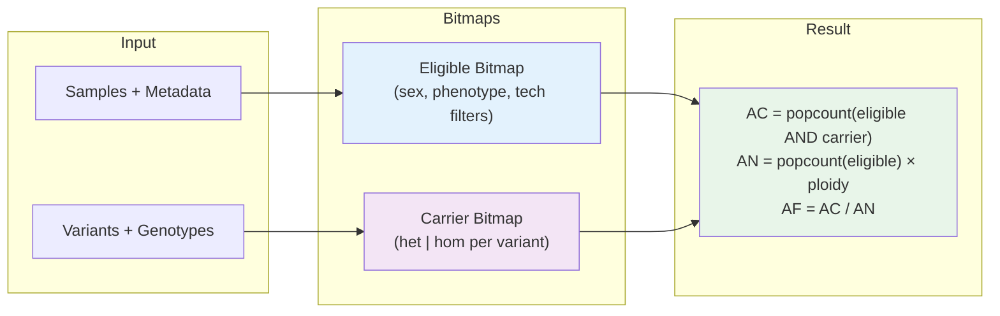
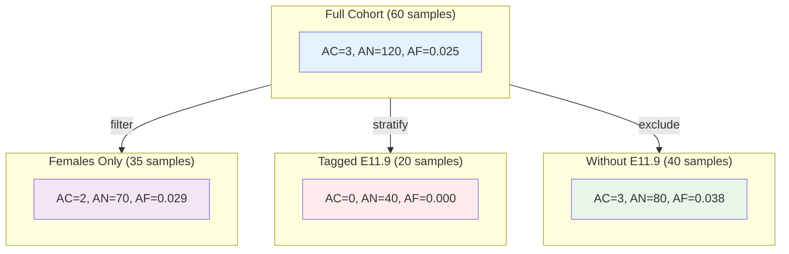

# Key Concepts

## Mental Model

**AFQuery = bitmap index over genotypes.**

For each variant, AFQuery stores a compressed bitset recording which samples carry the alt allele. For each query, it intersects the carrier bitset with an eligible-sample bitset, counts bits, and returns AC/AN/AF.

```
Samples → Metadata → Filters → Eligible Bitmap
Variants → Genotypes → het/hom Bitmaps
Query: (eligible bitmap) AND (carrier bitmap) → AC; count(eligible) → AN; AC/AN → AF
```



---

## Why Cohort-Specific AF Matters

Allele frequency is not a fixed property of a variant — it is a property of a population. Frequencies vary substantially across ancestry, sequencing technology, and clinical composition. Global databases like gnomAD are invaluable but may not reflect your cohort's background, leading to misestimated AF and incorrect variant classification.

AFQuery lets you compute allele frequencies on exactly the samples in your hands — and on any dynamically defined subset of them — without rebuilding the database.

For a detailed discussion of the methodological gaps AFQuery addresses, including real-world reclassification examples and peer-reviewed references, see [Why Local Allele Frequencies Matter](motivation.md).

---

## Allele Frequency (AC / AN / AF)

For a given variant (chromosome, position, ref, alt):

- **AC** (Allele Count) — number of copies of the alt allele observed across eligible samples
- **AN** (Allele Number) — total number of alleles examined (2× diploid samples, 1× haploid)
- **AF** (Allele Frequency) — `AC / AN` (None when AN = 0)

A heterozygous carrier contributes AC=1; a homozygous alt carrier contributes AC=2.

### Ploidy

AN depends on the chromosome and sex of eligible samples:

| Chromosome | Female | Male |
|------------|--------|------|
| Autosomes (chr1–22) | 2 | 2 |
| chrX (non-PAR) | 2 | 1 |
| chrX (PAR1/PAR2) | 2 | 2 |
| chrY | 0 | 1 |
| chrM | 1 | 1 |

See [Ploidy & Special Chromosomes](../advanced/ploidy-and-sex-chroms.md) for PAR coordinates.

### Worked Example

Consider a cohort of 60 samples (50 diploid autosomes) with a variant at position chr1:925952 G>A:

| Group | Eligible samples | AN | AC | AF |
|-------|-----------------|----|----|-----|
| Full cohort (all 60) | 60 samples | 120 | 3 | 0.025 |
| Females only (35) | 35 samples | 70 | 2 | 0.029 |
| Tagged `E11.9` (20) | 20 samples | 40 | 0 | 0.000 |
| Not tagged `E11.9` (40) | 40 samples | 80 | 3 | 0.038 |

!!! Tip AN calculation
    AN is not always `2 × cohort_size`. Eligible samples change per query, so AN reflects your chosen subgroup exactly.

### Visualization

The same variant can show dramatically different allele frequencies across subgroups:



---

## How AFQuery Stores Data

### Per-Variant Bitmaps

For each variant row, AFQuery stores per-sample genotype information as [Roaring Bitmaps](https://roaringbitmap.org/). Three of them drive every query:

- **`het_bitmap`** — sample is heterozygous (`GT=0/1`) with `FILTER=PASS`
- **`hom_bitmap`** — sample is homozygous alt (`GT=1/1`, or `GT=1` on haploid regions) with `FILTER=PASS`
- **`fail_bitmap`** — the sample's call at this site has `FILTER≠PASS`

Each sample has a stable integer ID (0-indexed). The bit position in the bitmap equals the sample ID. Databases built with coverage-quality filters carry two additional bitmaps — see [Data Model](../reference/data-model.md#parquet-schema).

### Parquet Storage

Bitmaps are serialized and stored in Parquet files, partitioned by chromosome and 1-Mbp bucket:

```
variants/
  chr1/
    bucket_0.parquet   ← positions 0–999,999
    bucket_1.parquet   ← positions 1,000,000–1,999,999
    ...
  chr2/
    ...
```

Rows within each bucket are sorted by `(pos, alt)`.

### Capture Index (WES)

For whole-exome sequencing (WES) and gene panels technologies, a BED file defines covered regions. AFQuery builds an interval tree (pickle file) per technology so queries can determine which WES samples are eligible at any given position.

```
capture/
  wes_v1.pkl   ← interval tree for wes_v1 BED
  wes_v2.pkl
```

WGS samples are always eligible (no BED file needed).

---

## The Manifest

The manifest is a TSV file that drives database creation. It maps each sample to its:

- VCF file path
- Sex (`male` / `female`)
- Sequencing technology
- Phenotype codes (arbitrary strings, comma-separated)

The manifest is parsed into `metadata.sqlite` during `create-db`. The original path is recorded in `manifest.json`.

---

## Sample Filtering Model

Queries can restrict the eligible sample set along three independent dimensions:

| Dimension | Filter | Default |
|-----------|--------|---------|
| **Sex** | `male`, `female`, or `both` | `both` |
| **Phenotype** | Include/exclude phenotype codes (arbitrary strings) | all samples |
| **Technology** | Include/exclude tech names | all samples |

Filters **compose with AND** across dimensions: a sample must satisfy all three to be eligible.

Within a dimension, multiple include codes compose with **OR** (a sample matching any code is included).

AN is computed only over eligible samples, so AF naturally reflects the chosen subgroup.

### The Metadata Model

**AFQuery treats phenotype codes as arbitrary string labels.** You can use:

- ICD-10 disease codes (International Classification of Diseases, 10th revision) — e.g., `E11.9`, `G40`
- Human Phenotype Ontology (HPO) terms — e.g., `HP:0001250`
- OMIM entries (Online Catalog of Human Genes and Genetic Disorders) — e.g., `OMIM:143100`
- Custom project tags (`control`, `rare_disease`, `pilot_cohort`)
- Technology subgroups (`panel_v1`, `panel_v2`)
- Any combination of the above

Multiple labels per sample are supported. There is no validation or controlled vocabulary — you define the ontology for your cohort.

When planning phenotype codes, consider:

- Codes can be updated after ingestion using `afquery update-db --update-sample` (see [Updating sample metadata](../guides/update-database.md#update-sample-metadata))
- Codes are case-sensitive: `E11.9` ≠ `e11.9`
- Trailing or leading spaces cause silent mismatch (always use `E11.9,I10`, never `E11.9, I10`)

---

PASS-only ingestion is always enforced. See [FILTER=PASS Tracking](../advanced/filter-pass-tracking.md) for details.

---

## Next Steps

- [5-Min Quickstart](quickstart.md) — build your first database and run queries
- [Sample Filtering](../guides/sample-filtering.md) — phenotype, sex, and technology filter syntax
- [Ploidy & Special Chromosomes](../advanced/ploidy-and-sex-chroms.md) — PAR regions and ploidy rules in detail
