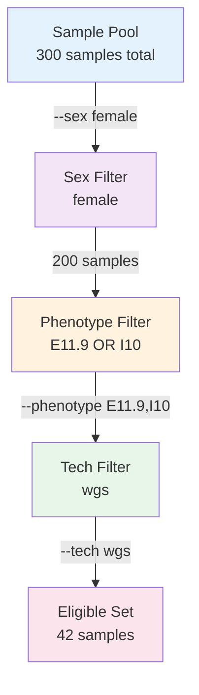

# Sample Filtering

AFQuery supports flexible metadata-based selection of samples for AF computation. Filters are available on all query commands (`query`, `annotate`, `dump`, `variant-info`).

**Phenotype codes are arbitrary string labels** — you define them in your manifest. They can be ICD-10 codes, HPO terms, project tags (`control`, `pilot`), or any strings meaningful to your cohort. The filtering system does not interpret the codes — it matches them exactly as stored.

---

## Filter Dimensions

Three independent filter dimensions are supported:

| Dimension | Flag | Default |
|-----------|------|---------|
| Sex | `--sex` | `both` |
| Phenotype | `--phenotype` | all samples |
| Technology | `--tech` | all samples |

Filters compose with **AND** across dimensions: a sample must satisfy all active filters to be eligible.

### Filtering Flow



---

## Sex Filter

```bash
--sex female     # only female samples
--sex male       # only male samples
--sex both       # all samples (default)
```

The sex filter affects AN computation on sex chromosomes (chrX/chrY/chrM). See [Ploidy & Sex Chromosomes](../advanced/ploidy-and-sex-chroms.md).

---

## Phenotype Filter

### Include a Single Code

```bash
--phenotype E11.9    # samples tagged E11.9 (any string works)
```

### Include Multiple Codes (OR logic)

Repeat the flag or use comma-separated values:

```bash
--phenotype E11.9 --phenotype I10    # samples with E11.9 OR I10
--phenotype E11.9,I10                # equivalent shorthand
```

### Exclude Codes

Prefix with `^`:

```bash
--phenotype ^E11.9    # all samples EXCEPT those with E11.9
```

### Combine Include and Exclude

```bash
--phenotype E11.9 --phenotype ^I10    # samples tagged E11.9 but NOT tagged I10
```

### No Phenotype Filter (default)

Omitting `--phenotype` includes all samples regardless of phenotype.

### Pseudo-control Queries

A common pattern is computing AF over all samples *except* a specific group, effectively using the rest of the cohort as controls:

```bash
# All samples except those tagged with cardiomyopathy ICD code
afquery query --db ./db/ --locus chr1:925952 --phenotype ^I42

# All samples except those with a specific project tag
afquery query --db ./db/ --locus chr1:925952 --phenotype ^pilot_cohort
```

See [Use Cases: Pseudo-controls](../use-cases/pseudo-controls.md) for a full worked example.

---

## Technology Filter

!!! note "Naming conventions"
    In the documentation, "WGS" (uppercase) refers to whole-genome sequencing as a concept. In CLI examples, `wgs` (lowercase) is used as the manifest technology name. Both work — the WGS check is case-insensitive. All other technology names are case-sensitive.

### Include a Technology

```bash
--tech wgs        # WGS samples only
--tech wes_v1     # wes_v1 samples only
```

### Include Multiple Technologies (OR logic)

```bash
--tech wgs --tech wes_v1    # WGS OR wes_v1 samples
--tech wgs,wes_v1           # equivalent shorthand
```

### Exclude a Technology

```bash
--tech ^wes_v1    # all technologies except wes_v1
```

---

## Composing Filters

Filters across dimensions require a sample to satisfy **all** conditions:

```bash
afquery query \
  --db ./db/ \
  --locus chr1:925952 \
  --phenotype E11.9 \
  --sex female \
  --tech wgs
```

This selects samples that are:

- Female **AND**
- Have phenotype code E11.9 **AND**
- Use WGS technology

---

## Effect on AN

AN is computed only over eligible samples. When filters are applied:

- Samples excluded by phenotype/sex/tech do not contribute to AN
- WES samples at positions outside their capture regions do not contribute to AN
- A result with `AN=0` means no eligible samples at that position

---

## Edge Cases

| Scenario | Result |
|----------|--------|
| No samples match include filter | `AC=0, AN=0, AF=None` |
| Include and exclude same code | `AC=0, AN=0, AF=None` (empty intersection) |
| WES-only tech at WGS-only position | `AC=0, AN=0, AF=None` |
| All samples excluded | `AC=0, AN=0, AF=None` |

---

## Using Filters in the Python API

```python
from afquery import Database

db = Database("./db/")

# Female WGS samples with the E11.9 phenotype code
results = db.query(
    chrom="chr1",
    pos=925952,
    phenotype=["E11.9"],
    sex="female",
    tech=["wgs"],
)

# Exclude wes_v1
results = db.query(
    chrom="chr1",
    pos=925952,
    tech=["^wes_v1"],
)
```

The `^` prefix exclusion syntax works the same in the Python API as in the CLI.

---

## Next Steps

- [Query Allele Frequencies](query.md) — apply filters in point, region, and batch queries
- [Cohort Stratification](../use-cases/cohort-stratification.md) — systematic multi-group AF comparison
- [Pseudo-controls](../use-cases/pseudo-controls.md) — exclusion-based background frequency for case enrichment
