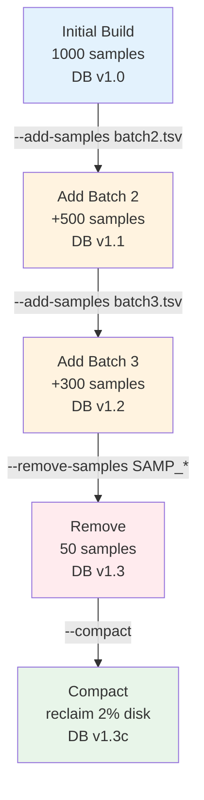

# Update a Database

`afquery update-db` adds new samples, removes existing samples, updates sample metadata, and compacts the database to reclaim space.

### Update Timeline



---

## Add Samples

Provide a new manifest TSV with the samples to add:

```bash
afquery update-db \
  --db ./db/ \
  --add-samples new_samples.tsv
```

The new manifest follows the same format as the original (see [Manifest Format](manifest-format.md)). New samples are assigned monotonically increasing sample IDs.

To add multiple manifests at once:

```bash
afquery update-db \
  --db ./db/ \
  --add-samples batch1.tsv \
  --add-samples batch2.tsv
```

For WES samples, provide the BED file directory:

```bash
afquery update-db \
  --db ./db/ \
  --add-samples new_samples.tsv \
  --bed-dir ./beds/
```

### Coverage-evidence handling

If the database was created with `--min-dp` / `--min-gq` / `--min-qual` /
`--min-covered`, the existing thresholds are read from the database and
re-applied to all samples — old and new. There is no `update-db` flag to
override them; thresholds are fixed at creation time so that quality
decisions are comparable across batches.

When new carriers push a partially-covered tech above the `--min-covered`
threshold at positions that were previously below it, those positions are
re-evaluated and their non-carrier samples once again count as `N_HOM_REF`
instead of `N_NO_COVERAGE`. The recomputation runs only for chromosomes
touched by the new samples; existing rows on other chromosomes are not
rewritten.

VCFs added via `update-db` should preserve `FORMAT/DP` and `FORMAT/GQ` (the
bundled `resources/normalize_vcf.sh` does so by default). Samples without
those fields are still merged correctly but contribute no quality evidence.

See [Coverage Evidence](../advanced/coverage-evidence.md) for the full flag
reference and when to use each one.

---

## Remove Samples

Remove one or more samples by name:

```bash
afquery update-db \
  --db ./db/ \
  --remove-samples SAMP_001
```

Remove multiple samples:

```bash
afquery update-db \
  --db ./db/ \
  --remove-samples SAMP_001,SAMP_002,SAMP_003
```

Or repeat the flag:

```bash
afquery update-db \
  --db ./db/ \
  --remove-samples SAMP_001 \
  --remove-samples SAMP_002
```

!!! note
    Removal marks the sample as inactive and clears its bit from all bitmaps. The physical bit position is not reused. Run `--compact` after removing many samples to reclaim disk space.

---

## Compact

After removing samples, compact the database to remove dead bits and reduce disk usage:

```bash
afquery update-db \
  --db ./db/ \
  --compact
```

This rewrites all Parquet files, removing bits for deleted samples. For large databases, compact runs in parallel and may take several minutes.

### When to Compact

- After removing more than 5–10% of samples
- When disk space is a concern
- Before archiving or sharing the database

---

## Combine Operations

Operations can be combined in a single command:

```bash
afquery update-db \
  --db ./db/ \
  --remove-samples SAMP_OLD_001 \
  --add-samples new_cohort.tsv \
  --compact
```

Operations execute in this order: remove → add → compact.

---

## Database Version

By default, the version label auto-increments (e.g., `1.0` → `2.0`). Set a custom version:

```bash
afquery update-db \
  --db ./db/ \
  --add-samples new_samples.tsv \
  --db-version 2026.03
```

---

## View Changelog

Every update operation is logged. View the history:

```bash
afquery info --db ./db/ --changelog
```

Example output:
```
v1.0  2026-01-15  create   1371 samples added
v2.0  2026-02-01  add       42 samples added
v2.0  2026-02-15  remove     3 samples removed
v3.0  2026-03-01  compact   compacted after removal
```

---


## Update Sample Metadata

Correct a sample's `sex` or `phenotype_codes` without re-ingesting its VCF. Precomputed bitmaps are regenerated and the change is logged in the changelog.

### Single sample

```bash
# Change sex
afquery update-db --db ./db/ --update-sample SAMP_001 --set-sex female

# Replace phenotype codes (replaces ALL current codes)
afquery update-db --db ./db/ --update-sample SAMP_001 --set-phenotype "E11.9,I10"

# Change both fields in one command
afquery update-db --db ./db/ \
  --update-sample SAMP_001 \
  --set-sex female \
  --set-phenotype "E11.9,I10"
```

### Batch update from TSV

Create a TSV file with a `sample_name`, `field`, `new_value` header. One change per row; the same sample can appear on multiple rows:

```
sample_name	field	new_value
SAMP_001	sex	female
SAMP_002	phenotype_codes	E11.9,I10
SAMP_003	sex	male
SAMP_003	phenotype_codes	C50
```

```bash
afquery update-db --db ./db/ --update-samples-file corrections.tsv
```

### Operator note

Attach a free-text note to every changelog entry created by the update:

```bash
afquery update-db --db ./db/ \
  --update-sample SAMP_001 \
  --set-phenotype "E11.9" \
  --operator-note "Corrected after clinical review 2026-03-19"
```

### Verify the change

```bash
# Inspect the changelog
afquery info --db ./db/ --changelog

# List samples to confirm new values
afquery info --db ./db/ --samples

# Query with the updated phenotype
afquery query --db ./db/ --locus chr1:925952 --phenotype E11.9
```

---

## Full Option Reference

See [CLI Reference → update-db](../reference/cli.md#update-db).

---

## Next Steps

- [Create a Database](create-database.md) — initial database creation from a manifest
- [Performance Tuning](../advanced/performance.md) — thread and memory configuration for the build phase
- [Multi-cohort Strategies](../advanced/multi-cohort-strategies.md) — organizing and versioning databases across cohorts
