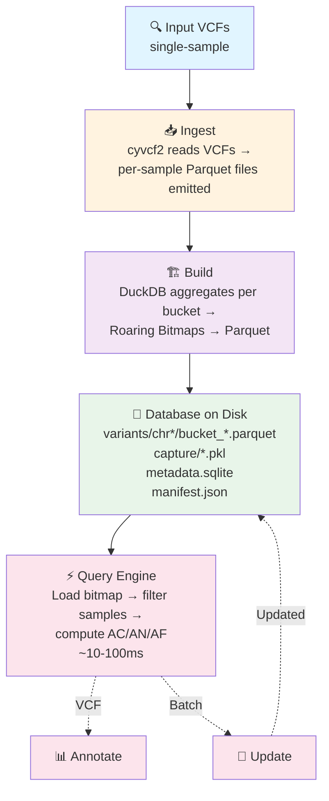
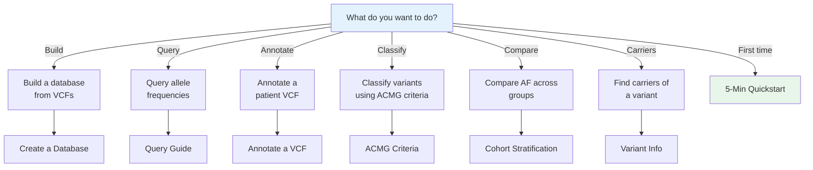

# AFQuery

**Fast, file-based genomic allele frequency queries for large cohorts. No server, no cloud — just files.**

AFQuery stores genotype data as Roaring Bitmaps in Parquet files and answers allele frequency queries in under 100 ms across large cohorts, with flexible filtering by sex, phenotype codes (arbitrary sample labels), and sequencing technology.

---

## When to Use AFQuery

- You need allele frequencies for **phenotype-defined subgroups** (not just whole-population AF)
- You mix **WGS, WES, and panels** in one cohort and need technology-aware AN
- You require **reproducible local AF** computed on your own samples — not just public reference databases
- You run **repeated queries** on the same dataset (annotation, clinical interpretation, research)
- You need **sub-100 ms query latency** without database servers or cloud infrastructure

---

## How It Works

AFQuery pre-indexes genotypes as [Roaring Bitmaps](https://roaringbitmap.org/) in Parquet files. At query time, it intersects carrier bitmaps with eligible-sample bitmaps (determined by sex, phenotype, and capture filters) and counts bits — reducing each query to microsecond-scale bitmap operations with sub-100 ms end-to-end latency.

---

## Features

- **Sub-100 ms queries** — bitmap operations, not VCF scanning. Latency is independent of cohort size.
- **Incremental updates** — add or remove samples without rebuilding the database.
- **Multi-dimensional filtering** — filter by sex, phenotype codes, and sequencing technology with include/exclude semantics.
- **Server-less** — a directory of Parquet files + SQLite. Copy to share, no daemon required.
- **Ploidy-aware** — correct AN on chrX PAR/non-PAR, chrY, and chrM.
- **Technology-aware AN** — per-position capture BED intersection across WGS, WES kits, and panels.
- **Carrier lookup** — list samples carrying any variant with full metadata (sex, tech, phenotypes, genotype, FILTER status).
- **VCF annotation** — add `AFQUERY_AC/AN/AF/N_HET/N_HOM_ALT/N_HOM_REF/N_FAIL/N_NO_COVERAGE` INFO fields from any sample subset.
- **Audit changelog** — every database operation is recorded for reproducibility.

---

## Architecture

---

## Where to Start

---

## Next Steps

- [Why Local AF Matters](getting-started/motivation.md) — population gaps, technology bias, and the research behind AFQuery
- [Installation](getting-started/installation.md) — pip, conda, from source
- [Quickstart](getting-started/quickstart.md) — 5-minute end-to-end tutorial
- [Key Concepts](getting-started/concepts.md) — bitmaps, Parquet, manifest, metadata model
